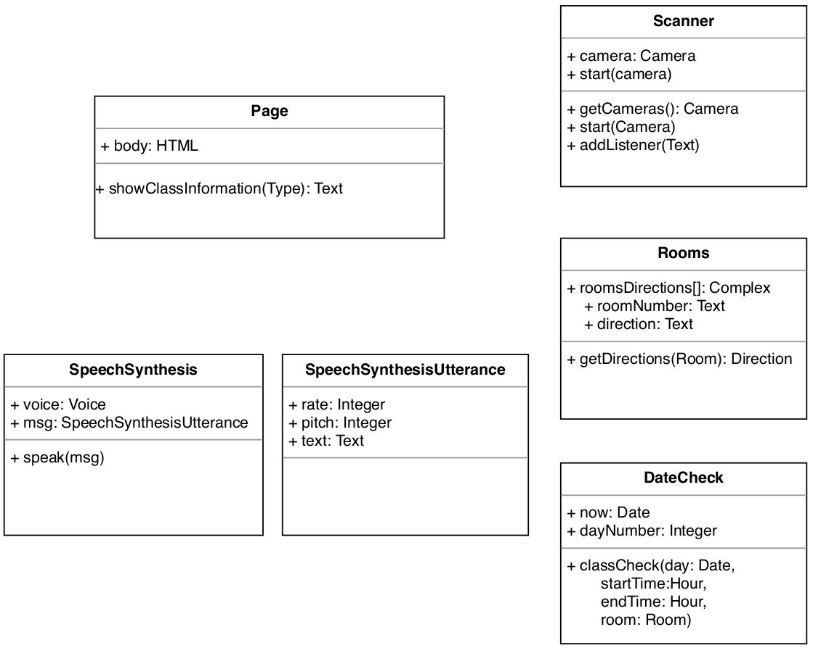
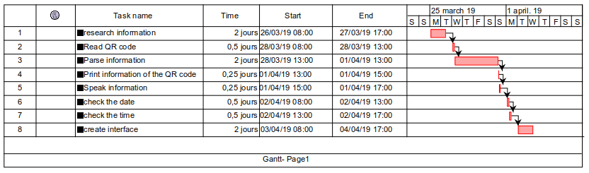

# Findmyway

__Findmyway__ is a usefull application that helps students of the Sligo Institute of Technology to optimize their day to day schedule. It provides a simple way to check if I am on time for a session and if so, it gives me directions to reach the classroom. All you have to do is to place the QR (Quick Response) Code provided with your schedule in front of the camera. Let the magic happen and read or lsten the result!

## Technical aspects

__Findmyway__ is a full web application that use different modules listed in the UML Class Diagram below.

## Organisational aspects

A backlog of the project can be find in the [github project](https://github.com/Yann98/findmyway/projects/1) part of this repository. It list the main functionalities expected for the prototype of __Findmyway__.

The Gantt diagram below give details about the organisation and work split that were adopted in order to achieve the delivery of this prototype.

